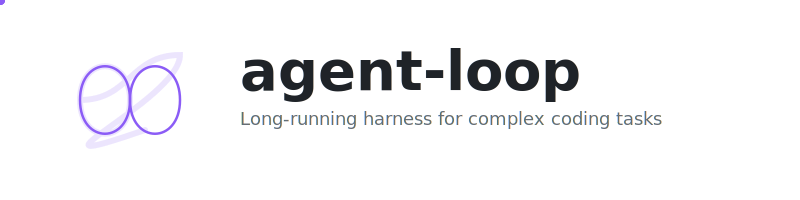

<p align="center">
  
</p>

<p align="center">
  <code>bun run ~/Projects/agent-loop/src/index.ts "Build a REST API"</code>
</p>

<p align="center">
  <a href="https://www.nushell.sh/"></a>
</p>

Long-running agent harness for complex coding tasks using the Claude Agent SDK.

## How It Works

Based on Anthropic's research on [Effective harnesses for long-running agents](https://www.anthropic.com/engineering/effective-harnesses-for-long-running-agents).

Three-phase approach:

1. **Initializer agent** - Sets up `feature_list.json` with comprehensive features, `claude-progress.txt` for tracking, and `init.nu` for environment setup
2. **Planner agent** - Explores codebase and creates `plan.md` with detailed implementation strategy
3. **Coder agent** - Implements the plan and marks features as passing

> **Note:** The original Anthropic research uses a two-phase approach (Initializer → Coder). We added a separate Planner phase to force codebase exploration before implementation, which may help prevent "one-shotting". This is experimental.

## Features

- **Incremental progress** - Works on exactly one feature per session, preventing scope creep
- **Session bridging** - Progress files let each new context window pick up where the last left off
- **Clean state guarantee** - Every session ends with committed, working code
- **Automatic verification** - Features only marked complete after full end-to-end testing

## Usage

```bash
# Initialize and run in current directory
agent-loop "Build a todo app with React"

# Specify project directory
agent-loop "Create a CLI tool" -d ./my-project

# Limit number of sessions
agent-loop "Implement auth system" -n 100
```

## Status

Early prototype. Implements the core patterns from Anthropic's research.
